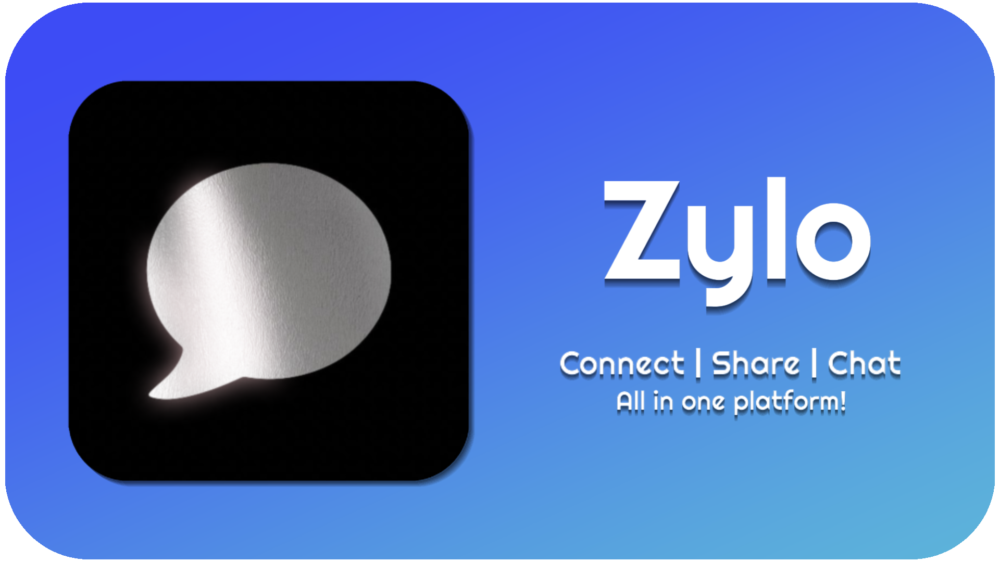

<div align="center">
  
  <h1><strong>The Ultimate Community Workspace</strong></h1>
  <p>
    A modern, high-performance platform for communication, collaboration,<br>
    and personal productivity — built with Python & Flask.
  </p>
</div>
<div align="center">
  


  
</div>

Zylo is a modern, high-performance community platform designed for seamless
communication, collaboration, and personal productivity.

Inspired by Discord’s usability and powered by a robust Python–Flask backend,
Zylo goes beyond messaging — combining social interaction, cloud storage,
utilities, and AI assistance into a single unified workspace.

## ✨ Core Features

- **💬 Real-time Communication**: High-speed group chats and Direct Messages with low-latency delivery.
- **🛡️ Secure Workspace**: Privacy-focused architecture with local data storage and encrypted session handling.
- **☁️ My Cloud**: Integrated 500MB personal cloud storage for files, documents, and media.
- **📖 Moments**: Share your life's highlights with a dedicated social feed for you and your friends.
- **🤖 AI Integration**: Built-in AI Chat assistant with multiple personas and models (via Gemini).
- **🛠️ Power Tools**: Built-in utilities like a scientific calculator, speed test, and quick notes.
- **🎨 Deep Customization**: Custom themes, profile effects, avatars, and banner customizations.
- **📈 XP & Leveling**: Gamified experience with XP gains from active participation.

## 🚀 Getting Started

### Prerequisites

- **Python 3.10+** (Older versions may cause compatibility issues)
- **Node.js** (Optional, for advanced frontend development)

### Quick Setup

1. **Clone the Repository**:
   ```bash
   git clone https://github.com/D4niel-dev/Zylo-Beta-1.x.x.git
   cd Zylo-Beta-1.x.x
   ```

2. **Install Dependencies**:
   Open a terminal/command prompt in the project root and run:
   ```bash
   pip install -r requirements.txt
   ```

3. **Launch Zylo**:
   You can start the server by running:
   ```bash
   python main.pyw
   ```
   Or double-click `main.pyw` in `script/main.pyw` if you are on Windows.

## 📱 Mobile Support (Pydroid 3/Pyramid)

Zylo is optimized for mobile via Pydroid 3/Pyramid. 
- Ensure all libraries from `requirements.txt` are installed.
- Update `local_ip` in `main.py` and `app.py` to match your device's IP.
- *Note: Performance on mobile devices depends on the available hardware.*

## 📂 Project Structure

- `backend/`: Python-Flask server, API routes, and logic.
- `frontend/`: HTML, CSS, and Client-side JavaScript.
- `backend/data/`: Persistent JSON storage (Users, Messages, Groups).
- `backend/uploads/`: User-uploaded media and cloud files.

## 🗺️ Roadmap

- **🔒 End-to-End Encryption**: Implementing E2EE for private Direct Messages.
- **📞 Voice & Video Calls**: Native WebRTC integration for high-quality calls.
- **📦 Plugin System**: Allow developers to create custom widgets and bots.
- **📱 iOS/Android Native**: Transitioning from Pydroid/Pyramid to a dedicated mobile app.
- **🤖 Real-time AI Chats**: Allow users to chat with a AI, but with multi-personals.

## 🛡️ Security & Privacy

Privacy is a top priority for Zylo.
- **Local First**: All message history and user data are stored securely on your server.
- **No Tracking**: We do not collect telemetry or usage data.
- **Granular Permissions**: Users have full control over who can message them or view their profile.

---

> [!NOTE]
> Zylo is currently in **Beta**. We are actively fixing bugs and improving performance for the full release. If you want to use the `ai-chat`, please install **Ollama** and choose any models that you want or use your own API key for the provider.

> [!IMPORTANT]
> Any feedback or reports should/would be sent to **@d4niel_1f**. Will get responsed after 2~5 hours after it is sended.

<p align="center" style="font-size: 520%; margin-top: 12px;">
  Developed with ❤️ by <strong>Daniel</strong>
</p>
